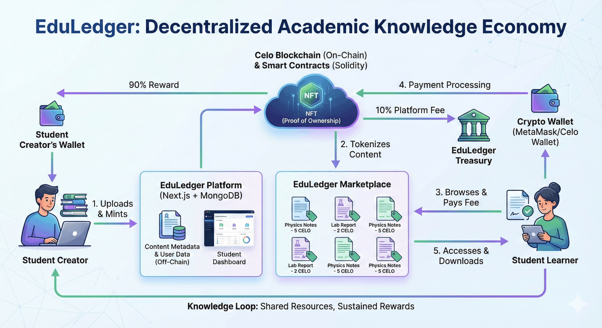

# EduLedger : Web3-powered, student-owned digital storage and marketplace platform

EduLedger is a Web3 powered educational platform that allows students to mint their academic materials  such as notes, lab reports, and study guides as NFTs on the Celo blockchain.
Other students can then access and download these materials by paying a small token fee, rewarding the original creator.
It's more than a repository  it's a knowledge economy where students earn from the value they create.



##  Problem Statement

In most academic environments, valuable student-created materials -notes, lab reports, research summaries, and solved assignments are shared informally or lost entirely after semesters.
There's no structured platform to preserve and reward quality content created by students.
Students who put effort into making helpful resources get no recognition or incentive.
Valuable academic work often ends up buried in chat groups, drives, or old devices, inaccessible to others who could benefit from it.
Access to quality study materials remains unequal, especially across different departments or institutions.
These challenges highlight a gap in academic knowledge sharing and ownership  a problem EduLedger aims to fix.

##  Solution

EduLedger transforms academic materials into digital assets (NFTs) that carry both value and ownership.
Students can upload and mint their resources on the Celo blockchain.
These NFTs serve as proof of authorship, ensuring creators maintain ownership and traceability.
Other students can download materials for a small token fee, rewarding the content creator.
This creates a self sustaining ecosystem where educational content is decentralized, accessible, and rewarding.
By leveraging Web3 principles, EduLedger brings transparency, fairness, and incentives into academic content sharing.

## Features

-   **NFT Minting:** Students can upload and mint their notes, lab reports, and study materials as NFTs on the Celo blockchain, gaining proof of ownership and authorship.
-   **Earn Rewards:** Contributors earn tokens whenever their materials are downloaded, creating an incentive-driven academic ecosystem.
-   **Organized Repository:** Materials are categorized by faculty and department, making it easy to find relevant resources.
-   **Transparent Transactions:** All uploads, downloads, and payments are recorded on-chain for full transparency.
-   **Wallet Integration:** Users connect via MetaMask to manage assets, earnings, and authentication securely.
-   **Collaborative Learning:** Encourages cross-department sharing and builds a community-driven network of knowledge exchange.

## Technologies Used

-   **Next.js:** Frontend framework (App Router) used for the web UI, routing, and client-side rendering.
-   **Express.js:** Backend API server for REST endpoints, file uploads, authentication helpers, and integration with Pinata/MongoDB.
-   **Celo Blockchain:** Powers NFT minting, ownership tracking, and reward transactions with low fees and a sustainable design.
-   **Solidity:** Used to write and deploy smart contracts that manage the minting, payments, and content ownership system.
-   **MongoDB:** Handles user data, material metadata, and transaction histories off-chain for better performance and scalability.
-   **Celo Wallet / MetaMask:** Provides secure wallet authentication and seamless on-chain interactions for users.

## Getting Started

### Prerequisites

-   Node.js (v18 or later)
-   npm, yarn, pnpm, or bun

### Install the dependencies

1.  Install frontend dependencies:
    ```bash
    cd frontend
    npm install
    ```

2.  Install backend dependencies:
    ```bash
    cd backend
    npm install
    ```

### Running the Application

1.  Start the frontend:
    ```bash
    cd frontend
    npm run dev
    ```

2.  Start the backend:
    ```bash
    # use a new terminal
    cd backend
    npm run dev
    ```

3.  Open [http://localhost:3000](http://localhost:3000) in your browser to see the application.


## Smart Contract

The `EduLedger` NFT smart contract is deployed and verified on the **Celo Sepolia testnet** at the following address:

**`0x84Ec2b6C277cff21F6D054e453F4d63790030eE5`**

👉 Take a look at `EduLedger.sol` in the `contracts` directory. You can view the contract on the [Celo Sepolia Block Explorer](https://celo-sepolia.blockscout.com/address/0x84Ec2b6C277cff21F6D054e453F4d63790030eE5).

To get free Celo tokens, primarily use dedicated Celo testnet faucets to obtain test tokens for development (e.g., [Celo Faucet](https://faucet.celo.org/celo-sepolia), [Google Cloud Faucet](https://cloud.google.com/application/web3/faucet/celo/sepolia), or [Tatum](https://tatum.io/faucets/celo)).

